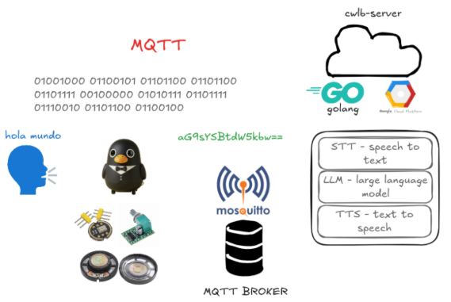
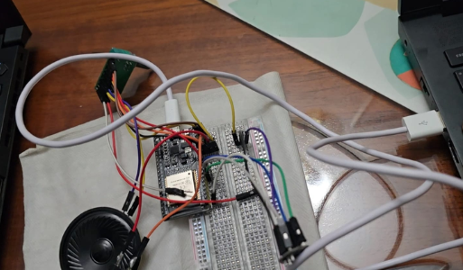

# Crowbot - Proyecto de Asistente IOT

## Resumen del Proyecto

> Los días modernos se están volviendo grises debido al sobreconsumo de contenido en redes sociales y la dependencia de herramientas de IA. Especialmente para las próximas generaciones.

**Crowbot** surge como un contrapunto a esta tendencia: un asistente de voz IoT que reimagina la IA como una fuerza positiva para el desarrollo infantil. Al crear un compañero de aprendizaje interactivo y con voz, Crowbot ayuda a los niños a desarrollar habilidades de comunicación genuinas, fomenta la curiosidad a través de la educación conversacional y proporciona una alternativa saludable a las interacciones pasivas basadas en pantallas.



### Visión y Misión

- **Reclamar la Infancia**: Combatir el envejecimiento de la infancia moderna ofreciendo experiencias de aprendizaje significativas e interactivas.
- **IA para el Bien**: Demostrar cómo la IA puede mejorar el desarrollo humano en lugar de reemplazar la conexión humana.
- **Innovación Educativa**: Cerrar la brecha entre la tecnología y la educación a través de interfaces de voz naturales.
- **Accesibilidad IoT**: Hacer que las herramientas avanzadas de aprendizaje con IA estén disponibles a través de dispositivos IoT asequibles y distribuidos.

### Características Clave y Beneficios

- **Motivación Educativa**: Transforma el aprendizaje en conversaciones lúdicas, haciendo que la educación sea agradable y menos intimidante para los niños.
- **Interacción Potenciada por Voz**: El reconocimiento y síntesis de habla naturales permiten a los niños comunicarse libremente, desarrollando habilidades lingüísticas y confianza.
- **Integración IoT**: Soporta tanto operación local independiente como procesamiento distribuido basado en MQTT para despliegues IoT escalables.
- **Aprendizaje Personalizable**: El sistema de prompts flexible permite contenido educativo adaptado para diferentes grupos de edad y materias.
- **Retroalimentación en Tiempo Real**: Las respuestas inmediatas de IA ayudan a reforzar conceptos de aprendizaje a través del diálogo interactivo.
- **Enfocado en la Privacidad**: Diseñado con la protección de datos infantiles en mente, con opciones de procesamiento local disponibles.

### Audiencia Objetivo

- Niños de 5-12 años curiosos.
- Educadores que buscan herramientas de enseñanza innovadoras.
- Padres que desean complementar métodos de aprendizaje tradicionales.
- Entusiastas de IoT que construyen dispositivos educativos inteligentes.

## Diagrama de Arquitectura

```
[Dispositivo Local / IoT] <--> Broker MQTT <--> [Servidor] <--> API HTTP <--> [Aplicación Web]
     |                           |              |
     v                           v              v
[Grabación de Audio] --> [STT] --> [LLM] --> [TTS] --> [Reproducción]
     |                           |
     +--> Prueba Local (cmd/local) |
     +--> Prueba MQTT (test_mqtt.sh)
```

## Características Futuras

### Iteraciones Planificadas

- [x] Broker MQTT
- [x] Backend MQTT
- [x] Pruebas Locales
- [x] Simulación de Flujo de Trabajo
- [x] Configuración Esp32 con sensores (micrófono, amplificador y altavoz)
- [ ] Persistencia de Base de Datos
- [ ] API Backend HTTP ApiRest
- [ ] Visualizador de Dashboard de Aplicación Web Frontend

## Arquitectura

### Componentes

- **Grabador Local** (`internal/utils/local_recorder.go`): Maneja la grabación de audio desde el micrófono, guarda en WAV y activa el procesamiento.
- **Orquestador Local** (`internal/core/local_orchestrator.go`): Coordina la canalización STT → LLM → TTS para procesamiento local.
- **Orquestador** (`internal/core/orchestrator.go`): Orquestador general para procesamiento basado en MQTT.
- **Cliente MQTT** (`internal/mqtt/client.go`): Maneja conexiones MQTT, publicación y suscripción para procesamiento distribuido.
- **Servicios**:
  - **GCP STT** (`internal/services/gcp_stt_service.go`): Convierte audio a texto usando Google Speech-to-Text.
  - **Gemini LLM** (`internal/services/gemini_service.go`): Procesa prompts de texto y genera respuestas.
  - **GCP TTS** (`internal/services/gcp_tts_service.go`): Convierte respuestas de texto a audio y maneja la reproducción.

### Flujo de Simulación Local

1. **Grabación**: El usuario presiona 'R' para iniciar/detener la grabación vía PortAudio.
2. **Procesamiento de Audio**: Los chunks PCM crudos se recopilan y guardan como `local_record.wav`.
3. **STT**: El archivo WAV se envía a Google STT (español), devuelve texto transcrito.
4. **LLM**: El texto se envía a Gemini con prompt del sistema, devuelve texto de respuesta.
5. **TTS**: El texto de respuesta se sintetiza a audio (voz en español).
6. **Reproducción**: El audio se reproduce vía PortAudio, y se guarda como `local_response.wav` para depuración.

### Flujo Distribuido MQTT

1. **Codificación de Audio**: Divide el audio grabado en chunks (ej. segmentos PCM de 1 segundo), codifica a base64.
2. **Publicación MQTT**: Envía chunks a tópicos MQTT (`/device/audio/start`, `/device/audio/chunk`, `/device/audio/end`).
3. **Procesamiento del Servidor**: El servidor MQTT se suscribe, reensambla el audio, ejecuta STT/LLM/TTS, divide la respuesta en chunks.
4. **Suscripción MQTT**: El cliente recibe chunks de respuesta de `/device/{device_id}/audio/response_chunk`, decodifica, reensambla y reproduce.
5. **Gestión de Chunks**: Usa números de secuencia y conteo total para ordenar.

### Prerrequisitos

- Go 1.25.1+
- Credenciales de Google Cloud
- Variables de entorno:
  - `GEMINI_API_KEY`: Tu clave de API de Gemini
  - `PROMPT`: Prompt del sistema para el LLM (ej. "Eres un asistente útil.")
- Dependencias: Instala con `go mod tidy`
- Para MQTT: Broker Mosquitto (ver `infra/mosquitto/mosquitto.conf`)

### Ejecutando Simulación Local

```bash
go run cmd/local/main.go
```

- Presiona 'R' luego Enter para iniciar la grabación.
- Habla en español.
- Presiona 'R' de nuevo para detener y procesar.
- El audio de respuesta se reproduce automáticamente.

### Ejecutando Servidor MQTT

```bash
go run cmd/mqtt/main.go
```

- Inicia el servidor MQTT escuchando en `tcp://localhost:1883`.
- Procesa chunks de audio de dispositivos y envía respuestas de vuelta.

### Probando MQTT

Usa el script de prueba proporcionado:

```bash
./test_mqtt.sh test.wav [broker] [port]
```

- Convierte `test.wav` a chunks, envía vía MQTT, recibe y reproduce respuesta.

#### Archivos Generados

- `local_record.wav`: Audio grabado (modo local).
- `local_response.wav`: Respuesta sintetizada (modo local).
- `combined.pcm`: Audio de respuesta reensamblado (modo MQTT).



Esta configuración permite escalar a múltiples dispositivos IoT mientras mantiene respaldo local.</content>
<parameter name="filePath">README.md
