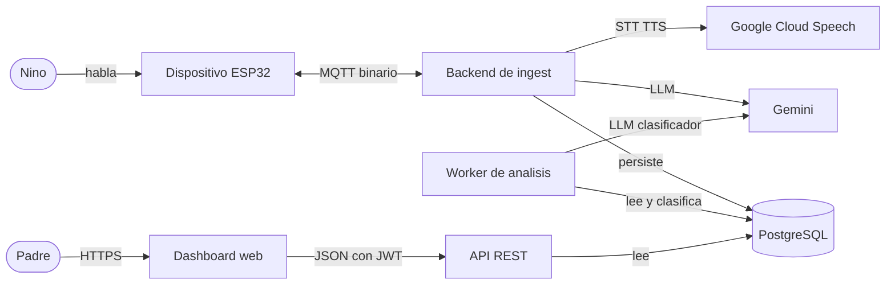

# 00 — Visión General del Sistema

> Punto de entrada a la documentación técnica de Crowbot. Aquí se explica **qué
> es** el sistema, **qué propiedades** persigue y **cómo leer** el resto de los
> documentos. Los capítulos siguientes (`01`…`08`) se leen en orden, de la
> frontera (el dispositivo) hacia el centro (los datos) y hacia afuera (la API y
> el dashboard).

## Qué es

Crowbot es un backend de voz **edge-to-cloud**: dispositivos IoT (ESP32) capturan
audio de un niño, lo transmiten por MQTT a un servidor concurrente que ejecuta un
pipeline STT → LLM → TTS detrás de una capa de IA intercambiable, persiste cada
turno en PostgreSQL, lo analiza de forma asíncrona para extraer señal de
desarrollo cognitivo, y lo expone por una API REST a un dashboard para padres.

Estos documentos en `docs/` describen el **sistema ya construido**: cómo se
compone, qué decisiones lo moldean y qué tradeoffs se aceptaron. El producto (un
robot que conversa con el niño y da insights a los padres) y el roadmap de
ingeniería por etapas se resumen en estos mismos capítulos.

## Las tres propiedades que guían el diseño

El sistema se diseña alrededor de las tres metas fundamentales de un sistema de
datos: **fiabilidad**, **escalabilidad** y **mantenibilidad**. No son etiquetas
abstractas; cada una se traduce en decisiones concretas y verificables.

### Fiabilidad — el sistema sigue funcionando ante fallos

- La capa MQTT usa QoS 1 (entrega *at-least-once*) y reensambla los chunks de
  audio por número de índice: un chunk perdido se **detecta y se reporta**, no se
  pierde en silencio (`02-device-protocol.md`).
- La persistencia es **best-effort y no-fatal**: si la base de datos falla, se
  registra el error pero la respuesta de voz al niño nunca se rompe
  (`04-data-model.md`).
- El worker de análisis es idempotente y reintenta: un turno que no se pudo
  clasificar queda marcado como pendiente y se reprocesa en el siguiente tick, sin
  escribir datos corruptos (`05-analysis-pipeline.md`).

### Escalabilidad — el sistema soporta crecimiento de carga

- El `device_id` viaja en el **topic** MQTT, no en el payload; el servidor se
  suscribe con wildcards y no mantiene un "dispositivo actual" global. Esto permite
  N dispositivos concurrentes sin estado compartido frágil (`02`, `03`).
- Cada sesión de dispositivo vive en un router keyed por `deviceID`, seguro ante
  concurrencia (verificado con `-race`). El estado por dispositivo está aislado.
- El análisis está **desacoplado** del camino crítico de voz: es procesamiento en
  segundo plano sobre el almacén, no en la respuesta al niño (`05`).

### Mantenibilidad — el sistema es fácil de operar y evolucionar

- La capa de IA es **vendor-neutral**: STT/LLM/TTS son interfaces con
  implementaciones `gcp`, `mock` y `local`. El proveedor es un detalle
  intercambiable, no una dependencia estructural (`03`).
- El acceso a datos usa SQL plano + sqlc (structs type-safe generados), sin la
  magia de un ORM (`04`).
- `cmd/mqtt` (ingest) y `cmd/api` (lectura) son binarios separados sobre el mismo
  `store`, lo que separa las rutas de escritura y de lectura (`01`).

## Diagrama de contexto

## Mapa de documentos

| Doc | Tema | Léelo si te interesa |
|-----|------|----------------------|
| [`01-architecture.md`](./01-architecture.md) | Composición del backend, recorrido de un turno | Cómo encaja todo |
| [`02-device-protocol.md`](./02-device-protocol.md) | Contrato MQTT, framing binario, fiabilidad del edge | La frontera dispositivo↔servidor |
| [`03-pipeline-orchestrator.md`](./03-pipeline-orchestrator.md) | STT→LLM→TTS, capa IA, concurrencia por sesión | El pipeline de voz |
| [`04-data-model.md`](./04-data-model.md) | pgx + sqlc + goose, esquema, atribución | Cómo y qué se persiste |
| [`05-analysis-pipeline.md`](./05-analysis-pipeline.md) | Worker asíncrono, clasificación, semántica de entrega | El eje de datos/ML |
| [`06-api-and-auth.md`](./06-api-and-auth.md) | REST, JWT, autorización por propiedad | La superficie de lectura |
| [`07-frontend.md`](./07-frontend.md) | Dashboard, types 1:1, modo mock | Cómo consume el cliente |
| [`08-operations-and-roadmap.md`](./08-operations-and-roadmap.md) | Modos de fallo, observabilidad, deploy | Operar y evolucionar |
