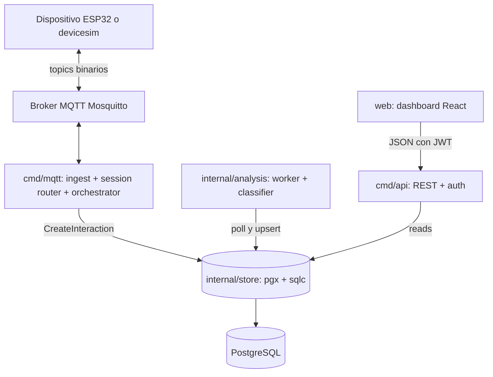
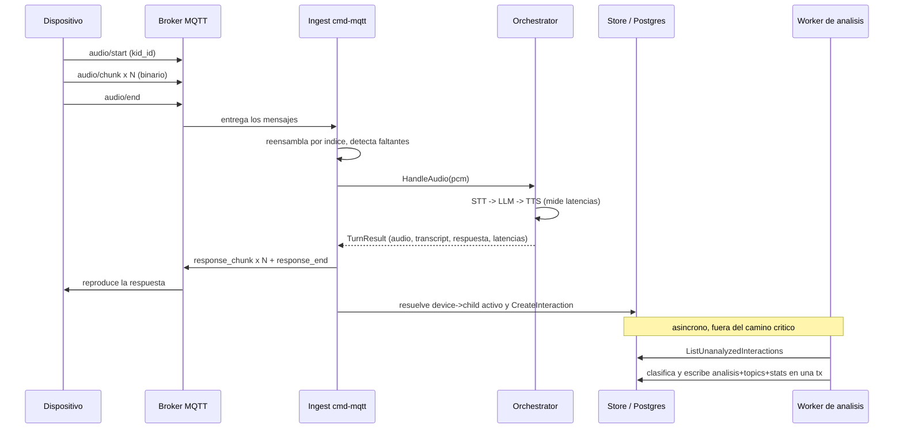

# 01 — Arquitectura y Composición del Backend

> Cómo se descompone el sistema en procesos y paquetes, qué responsabilidad tiene
> cada uno, y cómo fluye **un turno** de conversación de extremo a extremo.

## Componentes

El sistema son **dos binarios** sobre un almacén compartido, más un worker que
hoy vive dentro del binario de ingest:

- **`cmd/mqtt`** — el ingest. Se conecta al broker, reensambla audio, corre el
  pipeline STT→LLM→TTS, publica la respuesta y persiste el turno. Cuando hay
  `DATABASE_URL`, además arranca el worker de análisis en una goroutine.
- **`cmd/api`** — el servidor HTTP de lectura. Auth, gestión de cuentas/niños/
  dispositivos y los endpoints de dashboard.
- **`cmd/local`** y **`cmd/devicesim`** — herramientas: el primero corre el
  pipeline contra el micrófono real (requiere `-tags portaudio`); el segundo es
  un "ESP32 falso" en Go que habla el protocolo MQTT de punta a punta.

> Decisión: ingest y API son **procesos separados** sobre el mismo `store`. Esto
> aísla la ruta de escritura (camino crítico de voz, sensible a latencia) de la
> ruta de lectura (consultas del dashboard, sensibles a throughput) y permite
> escalarlas y desplegarlas por separado. El worker corre dentro de `cmd/mqtt`
> por simplicidad; extraerlo a su propio binario es un cambio mecánico cuando la
> carga lo justifique (`05-analysis-pipeline.md`).

## Responsabilidad de cada paquete

| Paquete | Responsabilidad | Frontera |
|---------|-----------------|----------|
| `internal/mqtt` | Suscripción, framing binario, session router, persistencia del turno | Habla con el broker y el `store` |
| `internal/core` | Orquestación STT→LLM→TTS, `TurnResult` con latencias | No conoce MQTT ni la DB |
| `internal/services` | Interfaces STT/LLM/TTS + impls `gcp`/`mock`/`local` | Aísla a los proveedores externos |
| `internal/store` | Pool pgx, código sqlc, queries a mano | Único punto de acceso a Postgres |
| `internal/analysis` | Worker de polling + clasificador LLM | Lee y escribe vía `store` |
| `internal/api` | Handlers HTTP, routing, respuestas JSON | Habla con el `store` |
| `internal/auth` | JWT (access/refresh) + bcrypt | Sin dependencias de dominio |
| `internal/config` | Carga de configuración desde entorno | Sin lógica de negocio |

El principio: el **orquestador es puro** (no sabe de dónde viene el audio ni a
dónde va el resultado). La atribución y la persistencia viven en la capa de ingest,
que es la única que conoce el `device_id` (porque está en el topic MQTT). Esto
mantiene el pipeline reutilizable y testeable de forma aislada.

## Recorrido de un turno

El camino completo de una frase del niño hasta una fila persistida y, después,
clasificada:

Lo importante de este diagrama: la respuesta de voz (`response_chunk`) se publica
**antes** de persistir, y el análisis ocurre **después y aparte**. El niño nunca
espera por la base de datos ni por la clasificación. Esa separación es lo que hace
que un fallo de persistencia o de análisis degrade el sistema en vez de romperlo.

## Configuración

`internal/config` carga todo desde entorno y permite que el sistema corra en
distintos modos sin recompilar:

- `CROWBOT_STT_PROVIDER` / `CROWBOT_TTS_PROVIDER` / `CROWBOT_LLM_PROVIDER` =
  `gcp` | `mock` | `local`.
- `MQTT_BROKER`, `PROMPT` (prompt del sistema), credenciales de GCP.
- `DATABASE_URL` **opcional**: si está vacío, el ingest corre sin persistencia ni
  análisis (útil para probar solo el transporte). Si está presente, se crea el pool
  y se arranca el worker.
