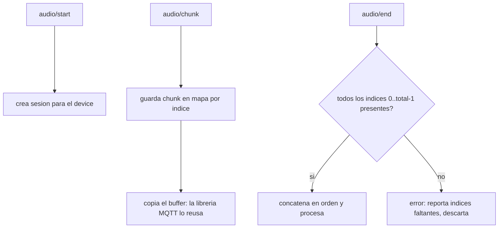

# 02 — Protocolo del Dispositivo (la Frontera Edge)

> El contrato entre el dispositivo y el servidor. Es la primera decisión de diseño
> que hay que fijar porque todo lo demás (persistencia, API, dashboard) se
> construye encima. Implementado en `internal/mqtt/client.go`; `cmd/devicesim` es
> la implementación de referencia.

## Tópicos: el `device_id` viaja en el topic, no en el payload

```
Subida (dispositivo -> servidor)
  /device/{id}/audio/start    JSON   {"kid_id":"..."}            una vez
  /device/{id}/audio/chunk    binario [u16 index][u16 total][PCM]  N veces
  /device/{id}/audio/end      vacio                                una vez

Bajada (servidor -> dispositivo)
  /device/{id}/audio/response_chunk  binario [u16 index][u16 total][PCM]
  /device/{id}/audio/response_end    vacio
```

El servidor se suscribe con **wildcards** (`/device/+/audio/start`, etc.) y extrae
el `{id}` del topic con `deviceIDFromTopic`. La consecuencia de diseño es grande:

> Decisión: identidad del dispositivo en el topic, no en el payload. El servidor
> **no mantiene un "dispositivo actual"** global mutable; cada mensaje es
> autodescriptivo. Esto elimina una clase entera de bugs de concurrencia (dos
> dispositivos pisándose el estado compartido) y hace que el ingest escale a N
> dispositivos de forma natural. Reemplazó al `currentDevice` global que tenía el
> prototipo.

## Framing binario: por qué no base64

Cada chunk de audio es PCM crudo de 16 bits precedido por dos enteros de 16 bits
little-endian: el índice del chunk y el total de chunks de la sesión.

```
byte:  0      1      2      3      4 ...
       [ index LE ]  [ total LE ]  [ PCM 16-bit ... ]
```

> Decisión: payload binario crudo en vez de base64. El ESP32 tiene ~200 KB de RAM
> usable. base64 infla el tamaño +33% y obliga a mantener buffers de
> codificación/decodificación de ~3 KB en el MCU. Con PCM crudo, procesar un chunk
> es un `memcpy`, no un `sprintf` + base64. El costo es perder la legibilidad del
> payload en herramientas de texto, lo cual es irrelevante para audio binario.

`parseChunk` valida que el payload tenga al menos 4 bytes (cabecera) antes de leer
índice y total; un payload corto se rechaza con error, no produce un pánico.

## Fiabilidad: QoS 1 y reensamblado con detección de pérdidas

Las suscripciones usan **QoS 1** (entrega *at-least-once*). El servidor acumula los
chunks en un mapa `index -> bytes` por sesión y, al recibir `end`, reensambla en
orden de índice.



Puntos clave del comportamiento real:

- **Detección de pérdida explícita.** `complete` recorre `0..total-1` y si falta
  algún índice devuelve un error con la lista de faltantes (`missing chunk indices
  ...`). Un chunk perdido **no** se ignora silenciosamente: la sesión se descarta
  con diagnóstico.
- **Idempotencia ante duplicados.** Como QoS 1 puede entregar un chunk más de una
  vez, guardar por índice en un mapa hace que un duplicado simplemente sobrescriba
  la misma entrada. El reensamblado es estable ante re-entregas.
- **Tolerancia a desorden.** Los chunks se ordenan por índice al reensamblar, no
  por orden de llegada. El transporte puede entregarlos desordenados.
- **Copia defensiva del buffer.** La librería Paho puede reutilizar el slice del
  payload tras el callback; `addChunk` copia los bytes antes de guardarlos para
  evitar corrupción por aliasing.

> Tradeoff: QoS 1 da *at-least-once*, no *exactly-once*. Se acepta porque el
> reensamblado idempotente por índice neutraliza los duplicados, y *exactly-once*
> en MQTT (QoS 2) cuesta un handshake de cuatro pasos por mensaje que no vale la
> pena para chunks de audio.

## Sesiones concurrentes

El `sessionRouter` mantiene un mapa `deviceID -> *audioSession` protegido por un
mutex, y cada sesión tiene su propio mutex para sus chunks. Dos dispositivos
distintos nunca comparten estado; dos mensajes del mismo dispositivo se serializan
en su sesión. Esta seguridad ante concurrencia está cubierta por tests con `-race`.

`processSession` corre en su **propia goroutine** (lanzada desde `handleEnd`), de
modo que reensamblar y procesar un dispositivo no bloquea la recepción de mensajes
de otros.

## Reproducción en streaming (lado dispositivo, diferido por hardware)

El servidor parte la respuesta en chunks de 32 KB (`publishResponse`) con el mismo
framing `index/total`. Esto habilita un modelo de reproducción importante en el
firmware:

> Decisión de diseño (firmware, gated por hardware): reproducir cada chunk a medida
> que llega a través de un ring buffer DMA por I2S, en vez de acumular toda la
> respuesta en RAM y luego reproducir. A 16 kHz/16-bit = 32 KB/s, acumular limita
> las respuestas a ~6 s antes de que falle el `realloc` en un MCU de ~200 KB. El
> protocolo `index/total` hace el streaming limpio (reproducir en orden, con un
> pequeño buffer de reordenamiento). Esto evita la falsa necesidad de una tarjeta
> SD. Detalle completo en [`PLAN.md`](../PLAN.md) Etapa 2.

El lado servidor de este contrato ya está implementado y verificado por
`cmd/devicesim` y `test_mqtt.sh`; la reproducción en streaming en el firmware queda
pendiente hasta tener el ESP32.
