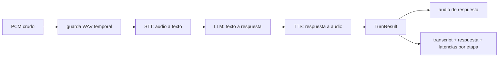
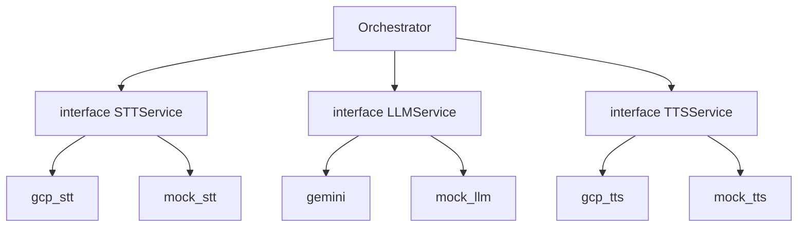

# 03 — Pipeline de IA y Concurrencia

> El corazón del camino de voz: cómo un buffer de audio se convierte en una
> respuesta hablada, cómo se aísla a los proveedores externos, y cómo el sistema
> sirve a muchos dispositivos a la vez sin corromper estado. Implementado en
> `internal/core/orchestrator.go` y `internal/services`.

## El pipeline STT → LLM → TTS

`Orchestrator.HandleAudio` ejecuta tres etapas en serie y devuelve un `TurnResult`
con todo lo que el turno produjo:



```go
type TurnResult struct {
    Audio          []byte
    Transcript     string
    ResponseText   string
    STTLatencyMs   int32
    LLMLatencyMs   int32
    TTSLatencyMs   int32
    TotalLatencyMs int32
}
```

> Decisión: `HandleAudio` devuelve un struct rico, no solo el audio. La alternativa
> era inyectar el `store` y el `device_id` dentro del orquestador y persistir ahí.
> Se rechazó porque acopla el pipeline a la base de datos y a la identidad del
> dispositivo. Devolviendo `TurnResult`, el orquestador queda **puro** y la capa de
> ingest (que sí conoce el `device_id` del topic) resuelve la atribución y la
> persistencia. Separación de responsabilidades: pipeline vs. persistencia.

## Medición de latencia por etapa

Cada etapa se cronometra con `time.Now()` / `time.Since`. Estos números se
persisten por turno en `interactions` (`stt_latency_ms`, `llm_latency_ms`,
`tts_latency_ms`, `total_latency_ms`).

> Por qué importa: la latencia por etapa es la base de la observabilidad futura.
> Tener percentiles separados de STT, LLM y TTS permite saber **qué** etapa domina
> la latencia de una respuesta lenta, en vez de medir solo el total. Es el primer
> paso hacia los histogramas de Prometheus de la Etapa 6 del roadmap
> ([`08-operations-and-roadmap.md`](./08-operations-and-roadmap.md)).

## Capa de IA vendor-neutral

Las tres etapas son **interfaces** (`STTService`, `LLMService`, `TTSService`) en
`internal/services`, con implementaciones intercambiables:



La implementación se elige por entorno (`CROWBOT_*_PROVIDER`). Esto da:

- **CI determinista y costo cero.** Con `mock_*`, el pipeline corre sin llamadas a
  la nube: STT devuelve transcripts predefinidos, TTS un WAV placeholder. Valida
  transporte, sesiones, persistencia y API sin gastar ni depender de la red.
- **Calidad cuando se necesita.** `CROWBOT_*_PROVIDER=gcp` usa Google Speech y
  Gemini reales.
- **El proveedor es un detalle, no una dependencia estructural.** Cambiar de
  Gemini a otro LLM es implementar una interfaz, no reescribir el orquestador. El
  worker de análisis reutiliza esta misma `LLMService` ([`05`](./05-analysis-pipeline.md)).

> Tradeoff explícito sobre el mock: `MockSTT` valida el **transporte y el
> cableado**, no la calidad de transcripción real. Es la diferencia entre "el
> sistema mueve y persiste los datos correctamente" y "el sistema entiende bien el
> español". Para lo segundo se cambia a `gcp`.

## Concurrencia: una sesión por dispositivo

El estado de audio en vuelo vive en el `sessionRouter` (ver
[`02-device-protocol.md`](./02-device-protocol.md)), keyed por `deviceID` y seguro
ante concurrencia. El orquestador en sí es **sin estado**: es un struct con tres
interfaces, llamado de forma reentrante desde la goroutine de cada sesión. No hay
estado mutable compartido entre turnos, por lo que N turnos de N dispositivos
corren en paralelo sin sincronización adicional en el pipeline.

> Esta es la corrección estructural sobre el prototipo: se eliminó la variable
> global `currentDevice` que asumía un solo dispositivo a la vez. Verificado con
> `go test -race`.

## Propagación de `context.Context`

`context.Context` se propaga por toda la cadena: `HandleAudio(ctx, ...)` lo pasa a
`STT.ConvertAudio(ctx, ...)`, `LLM.Ask(ctx, ...)` y `TTS.Synthesize(ctx, ...)`.

> Por qué: el contexto lleva cancelación y deadlines. Cuando el proceso recibe una
> señal de apagado, el `ctx` raíz se cancela y las llamadas en vuelo a los
> proveedores se abortan en vez de quedar colgadas. Es la base para timeouts por
> etapa y apagado ordenado (graceful shutdown, Etapa 5 del roadmap).

## Aislamiento de PortAudio

La captura/reproducción real por micrófono (PortAudio) está aislada detrás de
`//go:build portaudio`. El servidor, los tests y CI compilan **sin** la librería de
sistema; solo `cmd/local` (micrófono real) necesita `-tags portaudio`. Así una
dependencia nativa pesada no contamina el build del backend.
