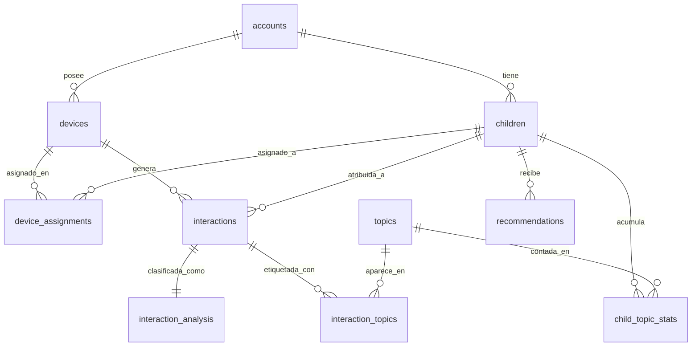
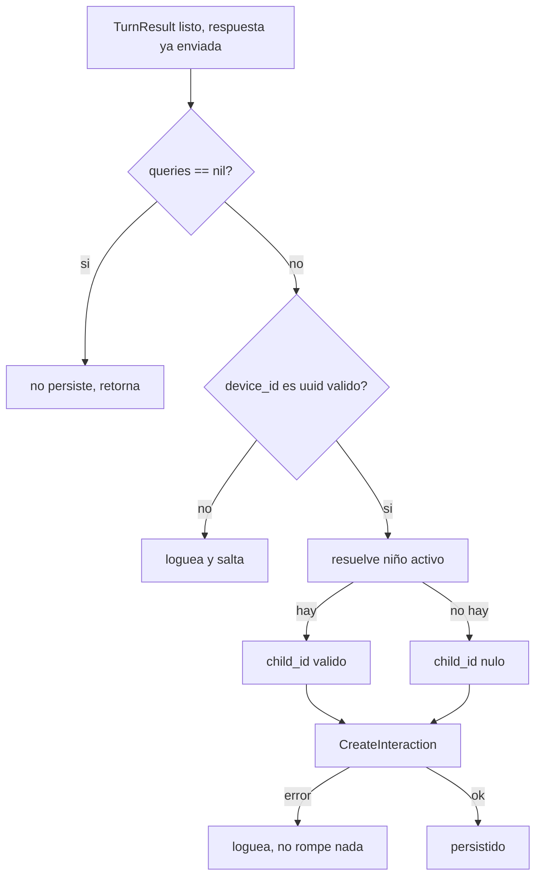

# 04 — Modelo de Datos y Persistencia

> Qué se guarda, cómo y por qué. El stack de datos, el esquema, el modelo de
> atribución niño↔dispositivo, y las decisiones de (des)normalización.
> Implementado en `internal/store` y `migrations/`.

## Stack de datos

| Pieza | Elección | Razón |
|-------|----------|-------|
| Driver | **pgx/v5** | Idiomático, rápido, tipos nativos de Postgres |
| SQL → Go | **sqlc** | SQL plano, structs type-safe generados, sin ORM |
| Migraciones | **goose** (`migrations/*.sql`) | Versionadas, SQL plano, separadas de las queries |

> Decisión: sqlc en vez de un ORM o de `database/sql` con `rows.Scan` manual. Se
> escribe SQL real en `db/queries/*.sql` y sqlc genera structs y métodos con tipos
> verificados en compilación. Se conserva el control total sobre las consultas (sin
> magia de ORM) y se elimina el boilerplate del scan manual. La alternativa
> `database/sql` + scan a mano se rechazó por la cantidad de código repetitivo y
> propenso a errores.

El acceso pasa siempre por la interfaz `store.Querier`, lo que permite dos cosas:
inyectar `nil` cuando no hay base de datos (el ingest corre sin persistir) y
construir un `store.New(tx)` sobre una transacción para operaciones atómicas
(ver [`05`](./05-analysis-pipeline.md)).

## Esquema

El esquema se construye en dos migraciones: `0001_init_pipeline.sql` (devices +
interactions del pipeline base) y `0002_product_platform.sql` (la capa de
producto: cuentas, niños, asignaciones, análisis y recomendaciones).



Tablas clave:

- **accounts** — padres. Email `citext` (case-insensitive) único, `password_hash`.
- **devices** — robots. Extendida con `serial_number` único, `activation_code_hash`
  (lo que codifica el QR, guardado **hasheado**), `account_id` nulo (nulo = sin
  reclamar), `last_seen_at`, `claimed_at`.
- **children** — perfiles de niño. `birthdate` para ajustar nivel y seguridad del
  LLM por edad.
- **device_assignments** — qué niño usa qué robot, con historial. Ver atribución
  abajo.
- **interactions** — un turno por fila: `transcript`, `response_text`, las cuatro
  latencias, `child_id` y `session_id`. Índice `(child_id, created_at DESC)` para
  el feed del dashboard.
- **interaction_analysis** — señal de desarrollo por turno (área cognitiva, tipo de
  pregunta, complejidad, sentimiento).
- **topics** / **interaction_topics** — taxonomía de temas (nodos del grafo) y su
  puente N:N con las interacciones.
- **child_topic_stats** — frecuencias por niño y tema, materializadas.
- **recommendations** — sugerencias para el padre.

## Atribución: el servidor resuelve, no confía en el dispositivo

La pregunta central del producto es "¿de qué niño es esta interacción?". La
respuesta de diseño:

> Decisión: **un solo niño activo por dispositivo a la vez.** El `device_id` viaja
> en el topic MQTT; el servidor resuelve `device -> account -> niño activo` desde
> `device_assignments` (`GetActiveChildForDevice`). El servidor **no confía** en un
> `kid_id` enviado por el dispositivo. Esto da atribución 100% confiable sin
> identificación on-device poco fiable y sin cambios de firmware.

Alternativas rechazadas:

- El robot pregunta "¿quién eres?" por sesión → identificación poco fiable + trabajo
  de firmware.
- Un robot permanentemente por niño → obliga a una compra por niño.

La invariante se aplica en la base de datos con un **índice único parcial**: a lo
sumo una fila `active` por `device_id`.

```sql
CREATE UNIQUE INDEX uq_device_active_assignment
    ON device_assignments (device_id) WHERE active;
```

El historial se preserva (las asignaciones viejas quedan con `active=false` y
`unassigned_at`), lo que permite reconstruir qué niño usó el robot en cada período.

## Persistencia no-fatal y `child_id` nulo

`persistInteraction` (en `internal/mqtt/client.go`) es **best-effort**:



Dos propiedades deliberadas:

- **Nunca bloquea la voz.** La respuesta de audio ya se publicó antes de persistir.
  Si la DB falla, se registra el error y el niño igual recibió su respuesta. La
  fiabilidad del producto (que el robot responda) no depende de la disponibilidad
  de Postgres.
- **`child_id` nulo permitido.** Un dispositivo sin asignación activa guarda la
  interacción igual, con `child_id` nulo (FK con `ON DELETE SET NULL`). No se
  pierde el dato por falta de atribución; se puede re-atribuir o analizar parcial.

> Nota operativa: si el dispositivo manda un id que no es un UUID o que no existe en
> `devices` (FK NOT NULL en `interactions.device_id`), la persistencia se salta sin
> romper la respuesta. En pruebas, `devicesim` debe usar un `device_id` que sea UUID
> y exista en `devices`.

## Desnormalización deliberada

`child_topic_stats` es una tabla **materializada**: cuenta cuántas veces un niño
tocó cada tema, con `first_seen_at` / `last_seen_at`. Se actualiza por el worker en
la misma transacción que escribe el análisis.

> Tradeoff: en vez de calcular el grafo de intereses con un `GROUP BY` sobre el
> puente `interaction_topics` en cada lectura del dashboard, se mantiene un contador
> incremental. Se paga una escritura extra por turno analizado a cambio de lecturas
> O(1) del grafo. Es la dualidad clásica escritura-vs-lectura: se optimiza para el
> caso de lectura frecuente (el padre abre el dashboard a menudo) sobre la escritura
> (un turno se analiza una vez).

Las gráficas de uso (heatmap día×hora) **no** se materializan: se calculan al vuelo
desde `interactions` con `date_trunc('hour', created_at)`. Si llega a pesar, se
puede agregar una tabla `daily_usage`; por ahora no lo justifica el volumen.

## Caso real de tradeoff: el bug de `pgtype.Interval`

sqlc generó la query de uso por hora (`ChildUsageByHour`) con el bucket tipado como
`pgtype.Interval`, lo que fallaba al escanear el resultado. En vez de pelear con la
generación, se escribió `ChildUsage` **a mano** en `internal/store/dashboard.go`,
casteando el bucket a `timestamptz`:

> Decisión: sqlc cubre el 95% de las queries; cuando su inferencia de tipos falla
> en un caso de borde (funciones temporales de Postgres), se escribe esa query a
> mano en el mismo paquete `store`, conservando la interfaz `Querier`. Lo
> verificado: `GET /api/children/{id}/usage` devuelve
> `{"bucket":"2026-06-14T00:00:00-05:00","interaction_count":1}` sin error de scan.
> La generada `ChildUsageByHour` quedó obsoleta (ya no se usa). Regenerar requiere
> tener `sqlc` instalado, que es el único paso pendiente del codegen.
