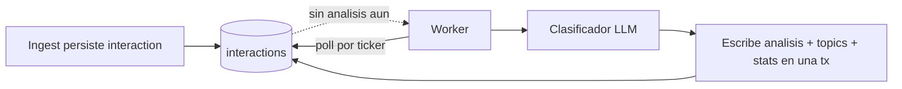
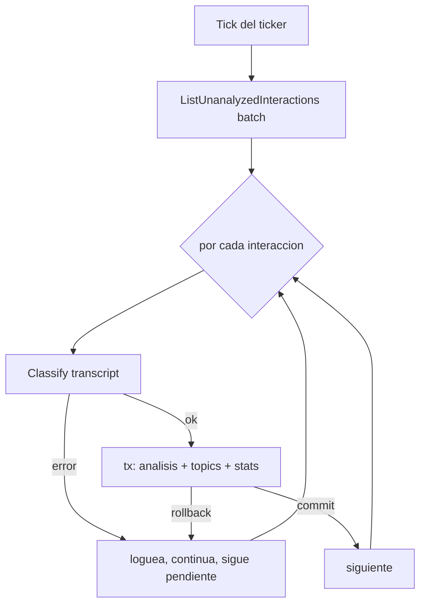

# 05 — Pipeline de Análisis Asíncrono

> El eje de datos/ML del sistema: convertir cada conversación en señal de
> desarrollo cognitivo, sin tocar el camino crítico de voz. Implementado en
> `internal/analysis` (`worker.go`, `classifier.go`).

## Por qué está desacoplado del ingest

El análisis es **procesamiento en segundo plano sobre el almacén**, no parte de la
respuesta al niño. El ingest persiste el turno y termina; el worker lo recoge
después.



> Decisión: separar análisis de ingest. La clasificación con un LLM tarda cientos
> de milisegundos a segundos y puede fallar (red, parseo). Ponerla en el camino de
> voz acoplaría la latencia y la fiabilidad de la respuesta del niño a un sistema de
> ML. Desacoplándola, el camino crítico solo hace una escritura barata
> (`CreateInteraction`), y el trabajo caro e inestable ocurre aparte, donde puede
> fallar y reintentar sin que nadie espere. Es la distinción entre procesamiento en
> línea (online) y por lotes (batch) de DDIA: el ingest es online; el análisis es
> batch sobre lo persistido.

## El worker: poll de la tabla

El `Worker` corre in-process (arrancado desde `cmd/mqtt` cuando hay DB) con un
ticker. Cada tick procesa un lote:



"No analizada" se define por ausencia: `ListUnanalyzedInteractions` trae las
interacciones que aún no tienen fila en `interaction_analysis`. Una vez escrita esa
fila, la interacción deja de aparecer en el poll.

## Semántica de entrega: at-least-once con idempotencia

Esta es la propiedad central del worker, y la que lo hace robusto:

- **At-least-once.** Si una interacción no se procesa (el clasificador falla, la red
  cae, la tx hace rollback), **permanece** sin analizar y se vuelve a tomar en el
  siguiente tick. Ningún turno se pierde por un fallo transitorio.
- **Idempotente.** La escritura usa upserts (`UpsertInteractionAnalysis`,
  `UpsertTopic`). Reprocesar la misma interacción no duplica datos: sobrescribe o no
  hace nada. Como el poll por ausencia + el upsert son ambos idempotentes,
  procesar dos veces es seguro.
- **No escribe basura.** Si el LLM devuelve algo que no parsea, el clasificador
  retorna error y la interacción queda pendiente; **no** se escribe una fila de
  análisis corrupta. Verificado: con `MockLLM`, el parse falla, se loguea y se
  reintenta, sin crashear ni ensuciar la tabla.

> Tradeoff: at-least-once (no exactly-once). Se acepta porque toda escritura es
> idempotente, lo que vuelve inocuo el reproceso. Exactly-once exigiría coordinación
> mucho más cara y no aporta nada cuando los efectos son idempotentes.

## Atomicidad: todo el análisis de un turno en una transacción

`analyzeOne` abre una transacción pgx y construye un `store.New(tx)`, de modo que
**todas** las escrituras de un turno (el análisis, cada topic con su upsert y su
link, y el bump del contador por niño) ocurren atómicamente:

```go
tx, _ := w.pool.Begin(ctx)
defer tx.Rollback(ctx)   // rollback salvo que se llegue al Commit
q := store.New(tx)
// UpsertInteractionAnalysis
// por cada topic: UpsertTopic + LinkInteractionTopic + BumpChildTopicStat
return tx.Commit(ctx)
```

> Por qué importa: sin la transacción, un fallo a mitad de camino podría dejar un
> análisis escrito pero topics a medias, o stats que no cuadran con los links. Con
> la tx, o se escribe todo y queda consistente, o no se escribe nada y se reintenta
> limpio en el siguiente tick. El `defer tx.Rollback` garantiza que cualquier salida
> temprana (un error en cualquier paso) deshace la transacción.

`BumpChildTopicStat` solo se ejecuta cuando `it.ChildID.Valid` es verdadero: el
grafo de intereses por niño solo tiene sentido para interacciones atribuidas. Una
interacción con `child_id` nulo igual se clasifica y se etiqueta con topics, pero no
incrementa contadores de ningún niño.

## El clasificador

`Classifier` envuelve la misma `LLMService` vendor-neutral del pipeline de voz
([`03`](./03-pipeline-orchestrator.md)). Envía el `transcript` con un prompt de
clasificación y espera JSON:

```json
{
  "cognitive_area": "language|logic-math|science|socio-emotional|creativity|social-world",
  "question_type": "curiosity|homework|emotional|play",
  "complexity": 1,
  "sentiment": "...",
  "topics": [{"slug": "...", "label": "..."}]
}
```

El parseo es **robusto**: limpia fences de markdown (```...```) que el LLM suele
agregar y hace clamp del nivel de complejidad al rango 1–5. Cubierto por
`classifier_test.go`.

> Reutilizar `LLMService` en vez de una dependencia nueva mantiene el proveedor
> intercambiable también para el análisis: el mismo switch `CROWBOT_LLM_PROVIDER`
> controla voz y clasificación.

## La decisión pendiente: poll-the-table vs. outbox

Hoy el worker hace **polling** de la tabla por un ticker. Es simple y suficiente
para el volumen actual, pero tiene límites conocidos:

> Tradeoff actual y camino de evolución: el polling introduce latencia (hasta un
> intervalo de ticker antes de procesar un turno) y hace consultas periódicas aunque
> no haya trabajo. Cuando el throughput lo justifique, el siguiente paso es un patrón
> **outbox**: el ingest, en la misma transacción que persiste la interacción, inserta
> un job en una tabla de outbox; el worker consume esa cola. Esto da menor latencia,
> backpressure natural y jobs que sobreviven reinicios sin reescanear. Se difiere
> a propósito (YAGNI): el poll idempotente ya da las garantías de fiabilidad; el
> outbox es una optimización de latencia/throughput, no de correctitud.

Extraer el worker a su propio binario (hoy vive en `cmd/mqtt`) es el otro paso de
escalado: permitiría escalar el análisis independientemente del ingest. También
diferido hasta que la carga lo pida.
