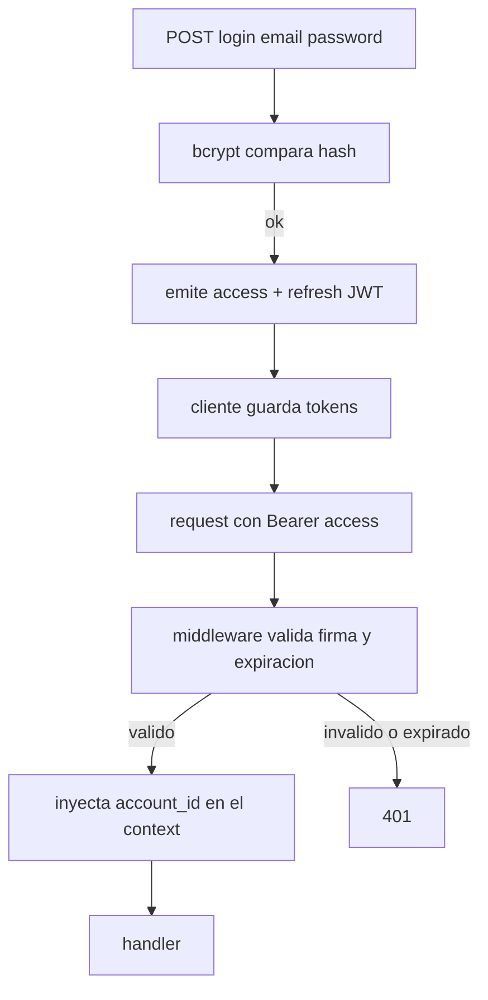

# 06 — API REST y Autenticación

> La superficie de lectura del sistema: cómo el dashboard del padre obtiene los
> datos, cómo se autentica y cómo se garantiza que un padre solo vea lo suyo.
> Implementado en `internal/api` y `internal/auth`.

## Superficie REST

Base URL `http://localhost:8080`. Auth por `Authorization: Bearer <access_token>`.

| Método | Ruta | Auth | Devuelve |
|--------|------|------|----------|
| POST | `/api/auth/signup` | no | `TokenResponse` |
| POST | `/api/auth/login` | no | `TokenResponse` |
| POST | `/api/auth/refresh` | no | `TokenResponse` |
| GET | `/api/children` | sí | `Child[]` |
| GET | `/api/children/{id}` | sí | `Child` |
| POST | `/api/children` | sí | `Child` (201) |
| GET | `/api/children/{id}/overview` | sí | KPIs + áreas + top topics |
| GET | `/api/children/{id}/usage?from&to` | sí | serie temporal de uso |
| GET | `/api/children/{id}/topics` | sí | grafo de intereses |
| GET | `/api/children/{id}/areas` | sí | desglose por área cognitiva |
| GET | `/api/children/{id}/recommendations` | sí | recomendaciones |
| GET | `/api/children/{id}/interactions?limit&offset` | sí | feed paginado |
| GET | `/api/devices` | sí | `Device[]` |

Los endpoints de dashboard son **solo lectura** y separados del ingest: viven en
`cmd/api`, no en `cmd/mqtt` (ver [`01-architecture.md`](./01-architecture.md)).

## Autenticación: JWT hecho a mano



- **JWT access + refresh** (`internal/auth/jwt.go`). El access token es de vida
  corta; el refresh permite renovarlo sin re-login.
- **bcrypt** para el hash de contraseñas (`internal/auth/password.go`). Nunca se
  guarda ni se compara la contraseña en claro.
- El middleware valida el token e inyecta el `account_id` en el `context.Context`
  de la request. Los handlers leen la identidad del contexto, no de la URL ni del
  body.

> Decisión: JWT artesanal en vez de una librería de sesiones con estado. Para una
> API stateless de lectura, los tokens autocontenidos evitan un store de sesiones
> y encajan con binarios separados y escalado horizontal: cualquier instancia de
> `cmd/api` valida cualquier token sin estado compartido.

## Autorización: propiedad, no solo autenticación

Autenticar (saber quién eres) no basta; hay que autorizar (saber si esto es tuyo).
Cada endpoint con `{id}` de niño pasa por `ownChild`:

```go
func (s *Server) ownChild(w, r) (store.Child, bool) {
    id := uuid.Parse(r.PathValue("id"))
    child := s.q.GetChild(r.Context(), id)
    if err != nil || child.AccountID != accountID(r) {
        writeError(w, 404, "child not found")   // ajeno -> 404, no 403
        return store.Child{}, false
    }
    return child, true
}
```

> Decisión: comprobación de propiedad en **cada** handler de recurso, y un niño que
> no es del solicitante devuelve **404, no 403**. Devolver 403 filtraría que ese id
> existe pero es de otro; 404 no revela nada. Es defensa contra enumeración de
> recursos. Verificado: niño ajeno → 404; sin auth → 401.

Este patrón (resolver el recurso y comprobar `AccountID == accountID(r)` antes de
hacer cualquier otra cosa) se repite en los seis endpoints de dashboard. Es
deliberadamente explícito y repetido en cada handler en vez de oculto en un
middleware genérico, para que la comprobación de propiedad sea visible en el punto
de uso.

## Contrato de respuestas

- **Errores**: JSON `{"error": "mensaje"}` con el código HTTP correspondiente. El
  cliente trata 401 → redirigir a login, 404 → empty state.
- **Listas nunca `null`**: el helper `orEmpty[T]` reemplaza un slice `nil` por
  `[]T{}` antes de serializar.

```go
func orEmpty[T any](s []T) []T {
    if s == nil { return []T{} }
    return s
}
```

> Por qué importa esta invariante: en Go un slice `nil` serializa a `null`, no a
> `[]`. Un cliente que hace `data.map(...)` sobre `null` revienta. Garantizar `[]`
> en el borde del servidor evita ramas defensivas (`data ?? []`) repartidas por todo
> el frontend. El contrato del tipo (`Foo[]`) se cumple siempre. Esto está reflejado
> 1:1 en los types del cliente ([`07-frontend.md`](./07-frontend.md)).

## Paginación y parámetros

`handleChildInteractions` pagina con `limit`/`offset`, con clamp de rango
(`limit` 1–200, default 50). `handleChildUsage` acepta `from`/`to` como RFC3339 o
`YYYY-MM-DD`, con default a la última semana. Los parseadores
(`parseIntParam`, `parseDateParam`) saturan al rango válido en vez de fallar ante
entrada inválida: una query malformada degrada a los defaults, no a un 400.
