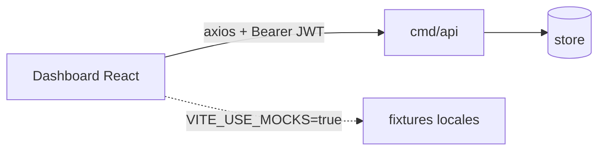

# 07 — Dashboard para Padres (Frontend)

> Cómo el cliente consume el sistema. Este documento cubre solo **cómo encaja el
> frontend en el sistema**; el detalle de implementación (estructura de carpetas,
> orden de construcción, theming) vive en [`frontend.plan.md`](../frontend.plan.md).
> Código en `web/`.

## Rol en el sistema

El dashboard es un SPA que consume la API REST de lectura
([`06-api-and-auth.md`](./06-api-and-auth.md)). No habla con MQTT ni con la base de
datos directamente: su única frontera es HTTP + JSON con JWT.



## Stack (minimalista a propósito)

| Pieza | Elección |
|-------|----------|
| Build | Vite + React + TypeScript |
| Routing | react-router-dom |
| HTTP | axios con interceptor JWT |
| Estado | React Context (solo auth + theme) |
| Estilos | CSS variables + CSS modules (paleta Notion B/N, dark/light) |
| Charts | CSS puro (sin librería) |

> Decisión: poca arquitectura. Sin react-query, sin Redux/Zustand, sin Tailwind,
> sin librería de charts. Un hook `useApi` de ~30 líneas y Context para lo poco que
> es global. La razón: la app tiene 4–5 rutas y dos pantallas de datos; introducir
> infraestructura de estado pesada sería complejidad sin retorno. Los charts (barras
> de áreas, heatmap de uso) empiezan en CSS puro y solo se evalúa una librería si la
> data real lo pide.

## Los types como contrato del sistema

`web/src/types/api.ts` refleja **1:1** el JSON del backend. Es el punto donde el
contrato del servidor se vuelve verificable en el cliente:

> Decisión: los types son la pieza más importante del frontend. Se confirmaron
> contra el smoke test real: `pgtype.Date` → `"YYYY-MM-DD"`, `pgtype.UUID` →
> `string | null`, `pgtype.Timestamptz` → string ISO `| null`. La invariante de
> "listas nunca null" del backend ([`06`](./06-api-and-auth.md)) permite tipar las
> listas como `Foo[]` sin `| null`, eliminando ramas defensivas en las páginas.

## Modo mock: capturas sin backend

Con `VITE_USE_MOCKS=true`, `web/src/api/index.ts` exporta handlers mock con la
**misma firma tipada** que los reales, sirviendo fixtures locales. Las páginas no
cambian entre modo real y mock.

```ts
import * as real from "./endpoints";
import * as mock from "../mocks/handlers";
export const api = import.meta.env.VITE_USE_MOCKS === "true" ? mock : real;
```

> Por qué: permite desarrollar la UI y tomar capturas sin levantar Postgres + el
> broker + los servicios. Como la firma es idéntica, el modo mock no es código
> muerto: ejercita exactamente las mismas llamadas que el modo real.

## Estado actual

Construido y con `npm run build` limpio: scaffold, types + fixtures, theming Notion
con dark/light, layout con sidebar, página de overview del niño (stat-cards, barras
de áreas, chips de topics, heatmap de uso, recomendaciones), página de
interacciones paginada, login y cliente axios con interceptor JWT (401 → login).

Pendiente (ver [`frontend.plan.md`](../frontend.plan.md) §9):

- Poner `VITE_USE_MOCKS=false` y probar contra el backend real (DB ya seedeada).
- Pulido responsive y QA visual dark/light en navegador.
