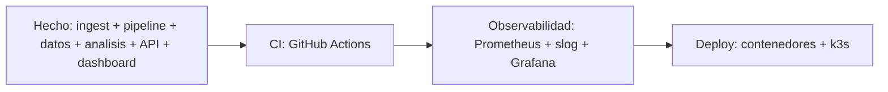

# 08 — Operación y Roadmap

> Cómo se comporta el sistema ante fallos, qué falta para operarlo en producción, y
> hacia dónde evoluciona. Resume los modos de degradación de los capítulos
> anteriores y las etapas pendientes del roadmap de ingeniería.

## Modos de fallo y degradación

El principio de diseño transversal: **fallar degradando, no rompiendo.** Cada
subsistema tiene una respuesta definida ante su fallo más probable.

| Fallo | Qué pasa | Por qué no rompe |
|-------|----------|------------------|
| Se pierde un chunk de audio | La sesión se descarta con error que lista los índices faltantes | Detección explícita; no hay audio corrupto reensamblado ([`02`](./02-device-protocol.md)) |
| Chunk duplicado (QoS 1) | Sobrescribe la misma entrada del mapa por índice | Reensamblado idempotente ([`02`](./02-device-protocol.md)) |
| PostgreSQL caído | Se loguea; la respuesta de voz ya se envió | Persistencia best-effort, fuera del camino crítico ([`04`](./04-data-model.md)) |
| Dispositivo sin asignación | La interacción se guarda con `child_id` nulo | FK `ON DELETE SET NULL`; no se pierde el dato ([`04`](./04-data-model.md)) |
| El LLM clasificador no parsea | La interacción queda pendiente y se reintenta | At-least-once + idempotente; no escribe basura ([`05`](./05-analysis-pipeline.md)) |
| Falla a mitad del análisis | La transacción hace rollback | Atomicidad; se reprocesa limpio ([`05`](./05-analysis-pipeline.md)) |
| Token inválido o expirado | 401 → el cliente redirige a login | Validación en el middleware ([`06`](./06-api-and-auth.md)) |
| Acceso a recurso ajeno | 404, sin revelar existencia | Comprobación de propiedad por handler ([`06`](./06-api-and-auth.md)) |

## Modos de ejecución

El sistema corre en configuraciones distintas sin recompilar, controladas por
entorno:

- **Sin DB** (`DATABASE_URL` vacío): el ingest procesa voz pero no persiste ni
  analiza. Útil para probar transporte y pipeline aislados.
- **Sin nube** (`CROWBOT_*_PROVIDER=mock`): pipeline end-to-end determinista, costo
  cero, sin red. Es la ruta de CI y de desarrollo diario.
- **Completo** (`gcp` + `DATABASE_URL`): STT/LLM/TTS reales, persistencia y análisis
  activos.

## Roadmap pendiente (eje distribuido)

Lo construido cubre el camino edge → MQTT → pipeline → persistencia → análisis →
API → dashboard. Las etapas que faltan para una historia de backend distribuido
completa:

- **CI (Etapa 5).** `go vet`, `golangci-lint`, `sqlc generate --check`, `go test
  -race` con un Postgres de servicio. Apagado ordenado (`signal.NotifyContext`) en
  todos los entrypoints. Multi-stage Dockerfile por servicio + `docker-compose`.
- **Observabilidad (Etapa 6).** Histogramas de latencia por etapa (la medición ya
  existe en el `TurnResult`, ver [`03`](./03-pipeline-orchestrator.md)), contadores
  de request/error, gauge de sesiones activas. Logs estructurados con `slog` (JSON)
  e IDs de correlación por sesión. Prometheus + Grafana locales.
- **Deploy (Etapa 7).** Manifiestos k8s en `deploy/k8s/` (Deployments, Services,
  Ingress, PVC para Postgres, Secrets/ConfigMaps, probes). Desplegar en k3s;
  documentar portabilidad a EKS.

## Deudas técnicas conocidas

- **sqlc no está instalado** en el entorno actual, así que no se pudo regenerar.
  `ChildUsageByHour` (generada) quedó rota pero ya no se usa: la reemplaza
  `ChildUsage` escrita a mano ([`04`](./04-data-model.md)).
- **El worker vive en `cmd/mqtt`.** Extraerlo a su propio binario permitiría
  escalar el análisis aparte del ingest ([`05`](./05-analysis-pipeline.md)).
- **Polling en vez de outbox** para el análisis: correcto pero con latencia de
  hasta un intervalo de ticker; migrar a outbox cuando el throughput lo justifique
  ([`05`](./05-analysis-pipeline.md)).

## Privacidad (datos de menores)

Son datos de niños. El diseño debe incluir opt-in explícito del padre para guardar
transcripciones y tener presente COPPA / GDPR-K (minimización de datos, límites de
retención, borrado). Señalado aquí; no bloquea la construcción inicial, pero es un
requisito antes de cualquier exposición real.

## SLOs aspiracionales

Una vez instrumentado (Etapa 6), los objetivos a vigilar serían percentiles de
latencia **por etapa** (STT/LLM/TTS por separado, no solo el total), tasa de chunks
perdidos por sesión, y lag del worker de análisis (cuántos turnos pendientes y por
cuánto tiempo). La medición por etapa ya está persistida en cada `interaction`, así
que estas métricas son derivables de los datos existentes.
